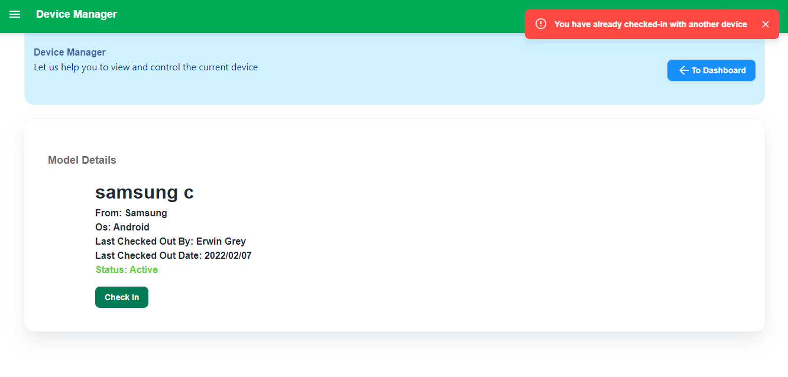

# Device Managing Tool

The web application which is built to keep track of testing devices. (both front end and back end) that sends and receives data.

## Welcome to the Device Manager


## Run Locally

Clone the project

```bash
  git clone https://github.com/Gowtham-J/J-J_Coding_Challenge.git
```

Go to the project directory

```bash
  cd server & cd client
```

Install dependencies

```bash
  npm install
```

Start the server

```bash
  npm start
```

## Features

### List of devices available

- which is visible in the device logs as shown below on a table with many properties


### Add new device

- Where we can add a new device which will be automatically set previously logged by the creator of the particular data

- A add button witch takes us to a add device form page
  

- A form page which has to be filled and submitted to complete the adding process
  

- A validation process will be like
  

- After successful device submission we receive
  

- If unsuccessful submission we receive a notification pop-up on the screen

### Device Info

- To view the information of the device we need to click on the view button which takes you to a new page which displays the information about the device
  

- The page below which contains an option of check-in or check-out and also shows the status of the device which may be in-active for more than 7days
  

- where we could check-in
  

- A user can only check-in a single device at a time
  

- A user cannot check in into a device which as already checked-in by other  
  

- A user can only check-out or check-in between 9am - 18pm
  

### Limited device allowance

- The application only allows a limited device up to 10 devices only where cannot be added no more
